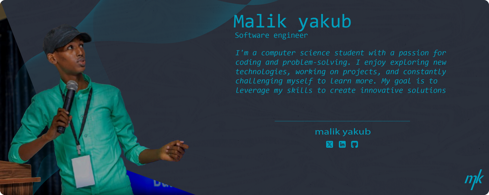

# Malik Yakub
### Software Developer

Welcome to my GitHub profile! I'm passionate about creating efficient and innovative software solutions.

## Skills
- Programming Languages: JavaScript, Python
- Web Technologies: HTML, CSS, React
- Database: MySQL, SQLite
- Version Control: Git, GitHub

## Tools
- Visual Studio Code
- Figma
- Adobe Photoshop
- Adobe Illustrator
- Adobe Lightroom

## Current Focus
I'm currently enhancing my skills in full-stack development and exploring cloud technologies.

## Connect with Me

Feel free to explore my repositories and don't hesitate to reach out for collaborations or discussions!
